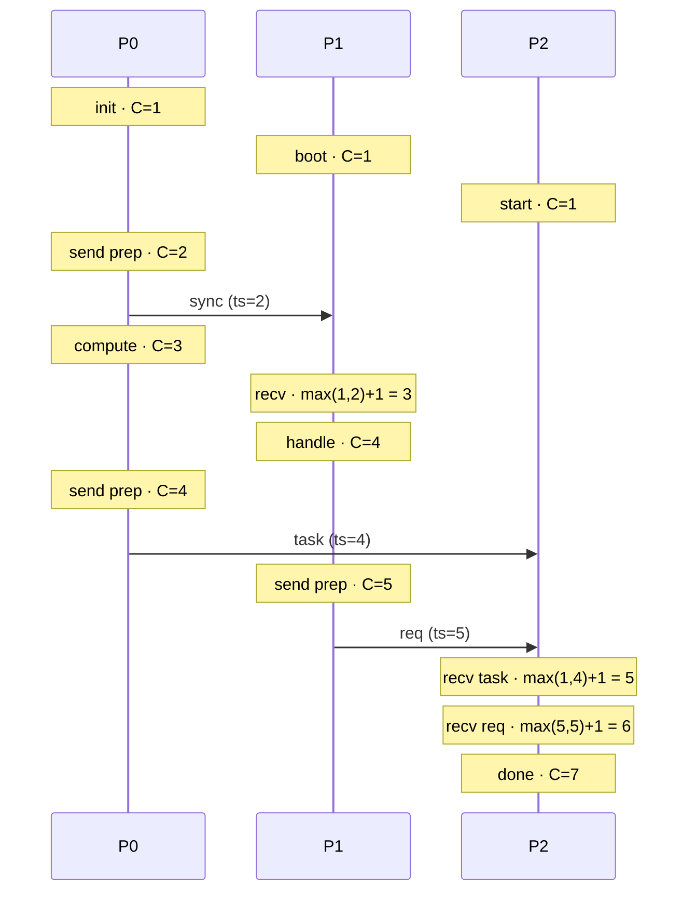
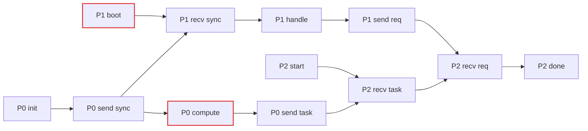
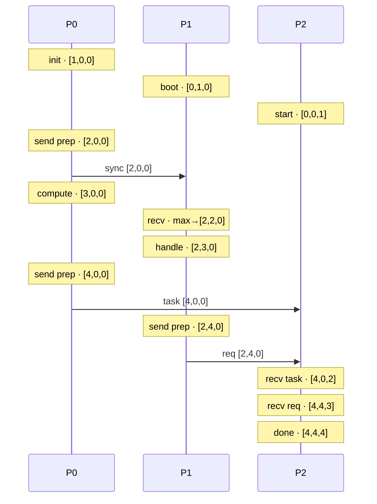

# Logical Clocks in Go — Lamport & Vector Clocks

A hands-on walkthrough of **logical time** in distributed systems, built to earn the intuition rather than just memorize the rules. It starts with Lamport clocks, watches them fall into their one famous trap, and then builds vector clocks to climb back out of it.

Everything here runs as small, self-contained Go programs: real goroutines exchanging real messages over channels, so you can watch the causality.

---

## Why logical clocks exist at all

In a single program, "what happened first" is obvious: the line above ran before the line below. Across a network of machines, that certainty gets diminished.

Each machine has its own physical clock, and those clocks drift. If machine A logs an event at `10:00:00.123` and machine B logs one at `10:00:00.119`, you **cannot** conclude B's event came first; the clocks were never synchronized to that precision, and synchronizing them perfectly is physically impossible.

But here's the reframe that makes the problem tractable: most of the time you don't actually care about *wall-clock* time. You care about **causality**: could event X have influenced event Y? Logical clocks throw away the pretense of real time and track causality directly, using nothing but counters.

### The happens-before relation (→)

This is the foundation everything rests on. Event `a` **happens-before** event `b` (written `a → b`) when any of these hold:

- `a` and `b` are in the **same process**, and `a` came first.
- `a` is the **send** of a message and `b` is the **receipt** of that same message.
- **Transitivity**: if `a → b` and `b → c`, then `a → c`.

If neither `a → b` nor `b → a`, the events are **concurrent**: they had no possible way of influencing each other. This is a *partial* order: concurrent events simply aren't related.

---

## Part 1 — Lamport Clocks

Each process keeps a single integer counter `C`, starting at 0, governed by three rules:

| Rule | Situation                              | Action                                      |
| ---- | -------------------------------------- | ------------------------------------------- |
| 1    | Any internal event                     | `C = C + 1`                                 |
| 2    | Sending a message                      | `C = C + 1`, then attach `C` to the message |
| 3    | Receiving a message with timestamp `T` | `C = max(C, T) + 1`                         |

Rule 3 is the clever one. The `max` yanks your clock forward to acknowledge the sender's progress; the `+1` guarantees the receive is strictly *later* than the send.

### Watching the rules in motion

Below is the exact three-process flow from the simulation. Read it top to bottom. Each note shows a clock value after its rule fires.



Notice P1 jumping straight from `1` to `3` when it receives `sync`: it skipped `2` entirely. That jump *is* the clock acknowledging work P0 had already done that P1 couldn't have known about.

### The guarantee and the catch

Lamport clocks give you exactly this:

> If `a → b`, then `C(a) < C(b)`.

Causality implies increasing timestamps. **But the converse is false.** `C(a) < C(b)` does *not* mean `a → b`; the two events might just be concurrent and have landed on those numbers by coincidence.

This is the single most misunderstood thing about Lamport clocks, and it's easiest to see with a concrete pair from the run above. Look at **`P1 boot`** (`C=1`) versus **`P0 compute`** (`C=3`):



Trace the arrows: there is **no path** connecting `boot` and `compute` in either direction. They're causally unrelated i.e genuinely concurrent. Yet `C(boot) = 1 < 3 = C(compute)`, so their timestamps *imply* an order that doesn't exist. The number lied, and Lamport clocks have no way to tell you it lied.

### Total order (the useful side of that lie)

Sometimes you want *some* consistent global ordering everyone agrees on, even across concurrent events: say, as a deterministic tie-break. Extend Lamport timestamps into a total order by breaking ties with the process ID: sort by `(timestamp, processID)`. Every process computes the identical order, and it never *contradicts* happens-before. It's perfectly good for tie-breaking; it just can't be read as causality.

---

## Part 2 — Vector Clocks

Vector clocks fix the exact hole above. The problem with a Lamport clock is that it compresses a process's entire history into one number, and that compression is lossy i.e you can't recover *whose* work made the number what it is. Vector clocks refuse to compress.

For a system of **N** processes, each process keeps a vector `V` of length N:

> `V_i[j]` = how many events at process `j` that process `i` currently knows about.

Your own slot `V_i[i]` is just your Lamport counter. Every *other* slot is your secondhand knowledge of how far that process has progressed: knowledge you can only gain through the chain of messages that reached you.

The rules mirror Lamport's, applied component-wise:

| Rule | Situation             | Action                                                         |
| ---- | --------------------- | -------------------------------------------------------------- |
| 1    | Internal event at `i` | `V_i[i] += 1`                                                  |
| 2    | Send at `i`           | `V_i[i] += 1`, then attach the **whole vector**                |
| 3    | Receive vector `W`    | `V_i[k] = max(V_i[k], W[k])` for every `k`, then `V_i[i] += 1` |

### The same flow, now in full color



When P1 receives `sync`, its vector becomes `[2,2,0]` and that vector is *legible* in a way `C=3` never was. Slot 0 says "I know P0 has done 2 events" (learned via the message); slot 1 says "I've done 2 myself." The two facts stay separate instead of collapsing into a single anonymous integer.

By the end, P2 lands on `[4,4,4]` no matter which message arrived first: it has heard everyone's complete history. The path varies with the scheduler; the destination doesn't.

### Comparing vectors — the payoff

Define `V ≤ W` when `V[k] ≤ W[k]` for **every** slot `k`, and `V < W` when `V ≤ W` and they differ somewhere. Now the guarantee becomes an **if-and-only-if**:

> `a → b`  ⟺  `V(a) < V(b)`

Both directions hold and *that* is what unlocks **concurrency detection**. If neither `V(a) < V(b)` nor `V(b) < V(a)`, the events are concurrent, guaranteed, with no false positives.

Back to the pair Lamport got wrong. `boot = [0,1,0]`, `compute = [3,0,0]`:

- Slot 0: `boot` has 0, `compute` has 3 → compute is ahead here.
- Slot 1: `boot` has 1, `compute` has 0 → boot is ahead here.

Each vector beats the other in a different slot. Neither is `≤` the other, they're **incomparable**, and incomparability *is* concurrency, reported with certainty. The extra bookkeeping you carried the whole time is precisely what makes this readable: each history contains an event the other has no trace of, so neither could have caused the other.

---

## Lamport vs Vector at a glance

|                         | Lamport        | Vector       |
| ----------------------- | -------------- | ------------ |
| State per process       | one integer    | N integers   |
| Data per message        | one integer    | N integers   |
| `a → b ⟹ smaller clock` | ✅              | ✅            |
| smaller clock `⟹ a → b` | ❌ (the trap)   | ✅            |
| Detect concurrency      | ❌ impossible   | ✅ exact      |
| Cost                    | tiny, constant | grows with N |

Neither is "better", they're different points on a trade-off. Lamport is cheap and gives you a usable total order; vector clocks pay N-per-message for the power to actually distinguish cause from coincidence.

---

## Running the project

```bash
cd lamport-clocks # run the lamport-clock simulation
go run .

cd vector-clocks # run the vector-clock simulation
go run .
```

The internal/concurrent events print in a **different order every run**, those events race, and that's realistic, because they're genuinely unordered. The **causal** pairs (every send→receive) stay pinned across every run. Run any phase a few times and watch the concurrent stuff float while the causal stuff stays locked. That contrast is the whole lesson in one observation.

---

*Built as a learning project to get the feel of logical time.*
